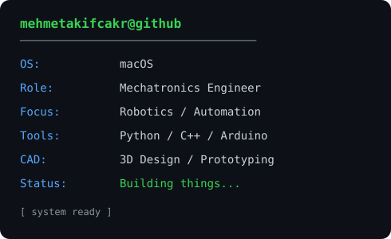

<h2><code>mehmetakifcakr@github ~ $ ./contributions.sh</code></h2>

  <em>Mechatronics Engineering • Robotics • Automation • Embedded Systems</em>

  

<h2><code>mehmetakifcakr@github ~ $ whoami</code></h2>

<table>
<tr>
<td valign="top">

</td>
<td valign="top">

</td>
</tr>
</table>

 

<code>⚡ Building • Learning • Prototyping • Automating</code>

  

<strong>tech stack</strong>

 

<code>Python</code> · <code>C++</code> · <code>Arduino</code> · <code>Embedded Systems</code> · <code>Robotics</code> · <code>Automation</code> · <code>3D CAD</code> · <code>Computer Vision</code>

 

Contribution data is refreshed automatically by GitHub Actions.

